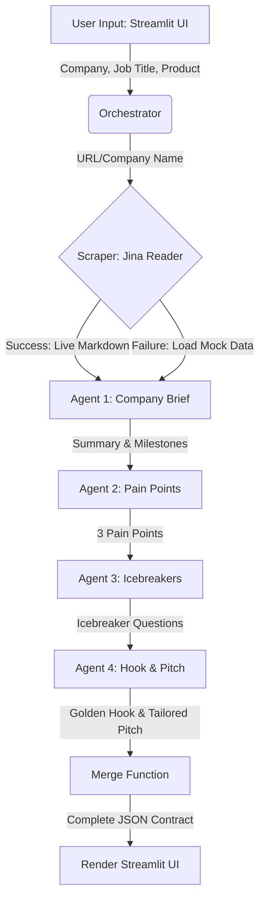

# Build & Execution Plan: Sales Call Prep-Sheet Generator

This document outlines the step-by-step plan to build and deploy the **Sales Call Prep-Sheet Generator**, an AI-powered B2B pre-call intelligence tool. It translates the design parameters and schemas defined in [Sales_Prep_Sheet_Product_Overview.pdf](file:///D:/ConsulBot/Overview/Sales_Prep_Sheet_Product_Overview.pdf) and [Sales_Prep_Sheet_Output_Mapping.pdf](file:///D:/ConsulBot/Overview/Sales_Prep_Sheet_Output_Mapping.pdf) into an actionable development roadmap.

---

## 1. Required Accounts & API Access

Before starting development, the following credentials and tools are needed:

1. **OpenRouter API Key** (`OPENROUTER_API_KEY`)
   - **Provider:** [OpenRouter](https://openrouter.ai/)
   - **Why:** Acts as the single gateway to all LLMs used across the multi-agent pipeline (Claude 3.5 Sonnet, Gemini 1.5 Flash, GPT-4o-mini).
   - **Access needed:** An active account with API credits and a generated key.
2. **Jina Reader API Key (Optional but Recommended)** (`JINA_API_KEY`)
   - **Provider:** [Jina AI Reader](https://jina.ai/reader/)
   - **Why:** Converts search engine results and company homepages into clean, LLM-friendly markdown. Standard public endpoints can be accessed without a key, but a free/paid Jina API key is recommended to prevent rate limiting.
3. **Local Python Environment**
   - **Setup:** Python 3.9+ with packages: `streamlit`, `pydantic`, `httpx`, `python-dotenv`, and `openai` (or equivalent client for OpenRouter calls).

---

## 2. System Architecture



### Chained Multi-Agent Pipeline & Schema Flow

| Stage | Agent Name | Consumes | Produces | Suggested Model |
| :--- | :--- | :--- | :--- | :--- |
| **0** | **Scraper** | Company / Domain URL | `raw_context` (Markdown) | Jina Reader API |
| **1** | **Company Brief** | `raw_context` | `short_summary`, `recent_milestones[]` | `google/gemini-flash-1.5` |
| **2** | **Pain Points** | `raw_context` + Job Title | `strategic_pain_points[]` (exactly 3) | `anthropic/claude-3.5-sonnet` |
| **3** | **Icebreakers** | Summary + Milestones + Job Title | `icebreaker_questions[]` (2–3 items) | `openai/gpt-4o-mini` |
| **4** | **Hook / Pitch** | All prior outputs + Product | `golden_hook`, `tailored_pitch` | `anthropic/claude-3.5-sonnet` |

---

## 3. Implementation Roadmap (Phased Approach)

### Phase 1: Environment & UI Skeleton
**Goal:** Establish the repository structure, dependency management, configuration files, and basic UI wireframe.
* [ ] **Set up Project Structure:**
  - Create directory layout:
    ```text
    ConsulBot/
    ├── Overview/                      # Project briefs and assets
    │   ├── Sales_Prep_Sheet_Product_Overview.pdf
    │   ├── Sales_Prep_Sheet_Output_Mapping.pdf
    │   └── build_plan.md
    ├── src/                           # Source code directory
    │   ├── app.py                     # Streamlit frontend entry point
    │   ├── orchestrator.py            # Chained pipeline logic
    │   ├── scraper.py                 # Jina Reader wrapper and caching
    │   ├── agents.py                  # Agent prompts and execution logic
    │   └── schemas.py                 # Pydantic schemas for verification
    ├── mock_data/                     # Pre-scraped company markdown fallbacks
    │   ├── stripe.txt
    │   ├── vercell.txt
    │   └── mock_company.txt
    ├── .env.example                   # Template for secrets
    ├── .gitignore                     # Git exclusion file
    └── requirements.txt               # Dependencies list
    ```
* [ ] **Define Requirements (`requirements.txt`):**
  - Pin versions for `streamlit`, `pydantic`, `httpx`, `python-dotenv`, and `openai`.
* [ ] **Configure Environment Variables (`.env`):**
  - Add placeholders for:
    ```env
    OPENROUTER_API_KEY=your_openrouter_api_key_here
    JINA_API_KEY=your_jina_api_key_here
    MODEL_COMPANY_BRIEF=google/gemini-flash-1.5
    MODEL_PAIN_POINTS=anthropic/claude-3.5-sonnet
    MODEL_ICEBREAKERS=openai/gpt-4o-mini
    MODEL_HOOK_PITCH=anthropic/claude-3.5-sonnet
    ```
* [ ] **Build Streamlit Skeleton UI (`src/app.py`):**
  - Implement 3 text inputs:
    1. **Company Domain / URL** (e.g., `stripe.com`)
    2. **Prospect Job Title** (e.g., `VP of Customer Support`)
    3. **Seller's Product / Solution** (e.g., `AI customer service agent that handles weekend queries`)
  - Create a **"Generate Prep Sheet"** button.
  - Implement an empty container (`st.empty()`) or spinner placeholders for the output sections.

---

### Phase 2: Data Extraction & Mock Layer
**Goal:** Integrate Jina Reader for scraping and implement a reliable fallback mechanism using mock datasets.
* [ ] **Write Jina Reader Wrapper (`src/scraper.py`):**
  - Design an async function `fetch_via_jina_reader(domain_url: str) -> dict`.
  - Format requests to `https://r.jina.ai/<domain_url>` (adding authorization headers if `JINA_API_KEY` is present).
  - Clean HTML-to-markdown output.
* [ ] **Create Caching and Offline Fallback Logic:**
  - Save 2–3 pre-scraped markdown files in `mock_data/` (e.g., Stripe, Vercel).
  - If the scraping API times out, fails, or rate-limits, fallback to reading from a mock text file.
  - Set a `meta.data_source` flag to `"live"` or `"cached"` accordingly.

---

### Phase 3: Pydantic Schemas & LLM Agents
**Goal:** Implement robust, structured LLM agents with runtime schema validation.
* [ ] **Define Schemas (`src/schemas.py`):**
  - Create Pydantic models matching each agent's JSON contract:
    - **`CompanyBriefSchema`**: `short_summary` (string), `recent_milestones` (list of strings).
    - **`PainPointSchema`**: `strategic_pain_points` (list of objects with `challenge` and `why_it_matters`). Validate that the list contains **exactly** 3 items.
    - **`IcebreakerSchema`**: `icebreaker_questions` (list of strings containing 2 to 3 questions ending in `?`).
    - **`HookPitchSchema`**: `golden_hook` (string, <=30 words), `tailored_pitch` (string).
    - **`FullPrepSheetSchema`**: Main schema combining all sections plus metadata (`company_name`, `job_title`, `seller_product`, `meta`).
* [ ] **Implement Agent Prompts & Model Calls (`src/agents.py`):**
  - Design specialized system prompts for each agent stage:
    1. **Agent 1 (Company Brief):** Focuses on extraction, condensing context into 2 sentences and finding 0-2 milestones.
    2. **Agent 2 (Pain Points):** Infers operational challenges based on job title and context. Enforces returning exactly 3 points.
    3. **Agent 3 (Icebreakers):** Formulates 2-3 genuine, open-ended business icebreakers.
    4. **Agent 4 (Hook & Pitch):** Acts as a B2B sales coach; crafts the single opener and the 3-4 sentence value proposition.
  - Write an async helper `call_openrouter(model: str, prompt: str, schema: Type[BaseModel]) -> BaseModel` that passes the prompt, requests JSON output (`response_format={"type": "json_object"}`), parses it, and validates it against the respective Pydantic schema.
* [ ] **Build the Orchestrator (`src/orchestrator.py`):**
  - Chain the 4 agent functions sequentially inside an async runner `generate_prep_sheet(...)`.
  - Implement defensive retry logic: if validation fails, re-prompt the LLM once with the validation error before failing or truncating/padding data.

---

### Phase 4: Polish & Streamlit Rendering
**Goal:** Present the synthesized output beautifully using Streamlit, highlighting key takeaways.
* [ ] **Render the Output Panel (`src/app.py`):**
  - **Header:** Render `company_name` and `job_title` in clean headers.
  - **Metadata Badge:** Add a small badge or caption at the top/bottom showing whether data is `"live"` or `"cached"`, along with the generation timestamp.
  - **Golden Hook Box:** Use `st.info()` or a stylized custom markdown blockquote at the very top. Make this highly visible and copy-pasteable.
  - **Company Brief & Milestones:** Show the summary and milestones in bullet points.
  - **Pain Points:** Render the 3 pain points using 3 distinct `st.expander()` containers or styled card containers (`st.container(border=True)`).
  - **Icebreakers:** Show the icebreaker questions in a numbered list.
  - **Tailored Pitch:** Show the pitch clearly under a dedicated "Suggested Pitch" subheader.
* [ ] **Export to PDF Feature (Optional Polish):**
  - Provide a button to export the generated page as a clean, downloadable PDF report.

---

## 4. Summary of Verification & Testing Plan
* **Schema Enforcement:** Every LLM response is automatically checked by Pydantic. Any missing fields or invalid structures trigger a fallback validation repair or structured exception handling.
* **Offline Mock Mode:** Testing can be done without calling Jina AI scraper by selecting a cached mock option.
* **Environment Swapping:** Teammates can modify the underlying LLMs for any agent (e.g., using GPT-4o-mini vs Gemini 1.5 Flash for the brief) dynamically by changing the `.env` values, without modifying any code.
