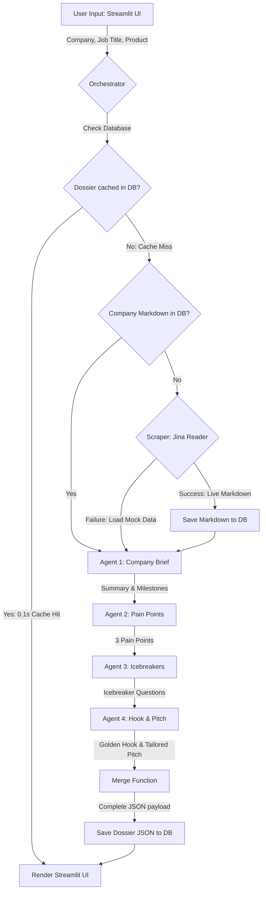

# Build & Execution Plan: Sales Call Prep-Sheet Generator

This document outlines the step-by-step plan to build and deploy the **Sales Call Prep-Sheet Generator**, an AI-powered B2B pre-call intelligence tool. It translates the design parameters and schemas defined in [Sales_Prep_Sheet_Product_Overview.pdf](file:///D:/ConsulBot/Overview/Sales_Prep_Sheet_Product_Overview.pdf) and [Sales_Prep_Sheet_Output_Mapping.pdf](file:///D:/ConsulBot/Overview/Sales_Prep_Sheet_Output_Mapping.pdf) into an actionable development roadmap.

---

## 1. Required Accounts & API Access

Before starting development, the following credentials and tools are needed:

1. **OpenRouter API Key** (`OPENROUTER_API_KEY`)
   - **Provider:** [OpenRouter](https://openrouter.ai/)
   - **Why:** Gateway to LLMs (Gemini, Llama, etc.).
   - **Access needed:** Active account with API credits.
2. **Jina Reader API Key (Optional but Recommended)** (`JINA_API_KEY`)
   - **Provider:** [Jina AI Reader](https://jina.ai/reader/)
   - **Why:** Converts search engine results and company homepages into clean markdown.
3. **Supabase Database / Postgres** (`SUPABASE_URL`, `SUPABASE_KEY`)
   - **Provider:** [Supabase](https://supabase.com/)
   - **Why:** Relational storage for company profile caching, historical generated prep-sheets, and saving token costs.
4. **Local Python Environment**
   - **Setup:** Python 3.9+ with packages: `streamlit`, `pydantic`, `httpx`, `python-dotenv`, `openai`, and `supabase`.

---

## 2. System Architecture



### Chained Multi-Agent Pipeline & Schema Flow

| Stage | Agent/Module Name | Consumes | Produces | Suggested Model |
| :--- | :--- | :--- | :--- | :--- |
| **0** | **Scraper & DB Cache**| Company Domain URL | `raw_context` (Markdown) | Jina Reader / Supabase |
| **1** | **Company Brief** | `raw_context` | `short_summary`, `recent_milestones[]` | `google/gemini-2.5-flash:free` |
| **2** | **Pain Points** | `raw_context` + Job Title | `strategic_pain_points[]` (exactly 3) | `meta-llama/llama-3-8b-instruct:free` |
| **3** | **Icebreakers** | Summary + Milestones + Job Title | `icebreaker_questions[]` (2–3 items) | `google/gemini-2.5-flash:free` |
| **4** | **Hook / Pitch** | All prior outputs + Product | `golden_hook`, `tailored_pitch` | `meta-llama/llama-3-8b-instruct:free` |

---

## 3. Implementation Roadmap (Phased Approach)

### Phase 1: Environment, DB & UI Skeleton
**Goal:** Establish the repository structure, dependency management, configuration files, database tables, and basic UI wireframe.
* [ ] **Set up Project Structure:**
  - Create directory layout:
    ```text
    ConsulBot/
    ├── Overview/                      # Project briefs and assets
    │   ├── Sales_Prep_Sheet_Product_Overview.pdf
    │   ├── Sales_Prep_Sheet_Output_Mapping.pdf
    │   └── build_plan.md
    ├── backend/                       # Backend code
    │   ├── __init__.py
    │   ├── schemas.py                 # Pydantic schemas
    │   ├── scraper.py                 # Scraper & database cache check
    │   ├── agents.py                  # Agent prompts and OpenRouter
    │   ├── orchestrator.py            # Orchestrator with DB checking
    │   └── database.py                # Supabase client helper
    ├── frontend/
    │   └── app/
    │       └── app.py                 # Streamlit frontend with History Sidebar
    ├── mock_data/                     # Pre-scraped company markdown fallbacks
    │   ├── stripe.txt
    │   ├── vercell.txt
    │   └── mock_company.txt
    ├── .env.example                   # Template for secrets
    ├── .gitignore                     # Git exclusion file
    └── requirements.txt               # Dependencies list
    ```
* [ ] **Define Requirements (`requirements.txt`):**
  - Add `supabase` for DB connection, alongside `streamlit`, `pydantic`, `httpx`, `python-dotenv`, and `openai`.
* [ ] **Configure Environment Variables (`.env`):**
  - Add placeholders for:
    ```env
    OPENROUTER_API_KEY=your_openrouter_api_key_here
    JINA_API_KEY=your_jina_api_key_here
    SUPABASE_URL=your_supabase_project_url_here
    SUPABASE_KEY=your_supabase_service_role_key_here
    MODEL_COMPANY_BRIEF=google/gemini-2.5-flash:free
    MODEL_PAIN_POINTS=meta-llama/llama-3-8b-instruct:free
    MODEL_ICEBREAKERS=google/gemini-2.5-flash:free
    MODEL_HOOK_PITCH=meta-llama/llama-3-8b-instruct:free
    ```
* [ ] **Initialize Database Tables:**
  - Run the SQL queries in `Plan/dataBase.md` within the Supabase SQL editor to create `company_profiles` and `sales_prep_sheets`.

---

### Phase 2: Database Layer & Data Extraction
**Goal:** Implement database helper functions, scraping checks, and fallback mechanisms.
* [ ] **Build Database Client (`backend/database.py`):**
  - Initialize the Supabase Async Client.
  - Implement CRUD helpers: `get_cached_company_profile`, `save_company_profile`, `get_cached_prep_sheet`, and `save_prep_sheet`.
* [ ] **Write Jina Reader Wrapper with DB Caching (`backend/scraper.py`):**
  - Check `company_profiles` in DB before sending HTTP requests to `r.jina.ai`.
  - Fallback to reading from local files in `mock_data/` if both DB and scraper fail.
  - Set a `meta.data_source` flag to `"live"`, `"cached"` (file fallback), or `"database"` accordingly.

---

### Phase 3: Pydantic Schemas & LLM Agents
**Goal:** Implement structured LLM agents with retry logic and full DB storage.
* [ ] **Define Schemas (`backend/schemas.py`):**
  - Adjust models to track granular state (e.g. data source can be `"database"`, `"live"`, or `"cached"`).
* [ ] **Build the Orchestrator with DB Lookup (`backend/orchestrator.py`):**
  - Before running the pipeline, query `sales_prep_sheets` using company, job title, and product pitch as keys.
  - If a record is found, return the parsed JSON payload instantly (0.1s).
  - If not found, execute the chained agent flow, write the final payload to `sales_prep_sheets` (linking to the `company_profiles` id), and return.

---

### Phase 4: Polish & Streamlit Rendering
**Goal:** Present the output in Streamlit, including a history sidebar and cache indicators.
* [ ] **Build History Sidebar (`frontend/app/app.py`):**
  - Fetch recent generated prep-sheets from `sales_prep_sheets` table and render them in a sidebar list.
  - Clicking on a historical prep-sheet loads its JSON payload immediately.
* [ ] **Render Cache Badges:**
  - Display whether the sheet was loaded via `"DATABASE_HIT"`, `"LIVE_API"`, or `"MOCK_FALLBACK"`.

---

## 4. Verification & Testing Plan
* **Database Mocking / Isolation:** Add flags to disable Supabase backend connection to allow offline development.
* **Schema Validation:** Pydantic validation handles DB outputs just like LLM outputs.
